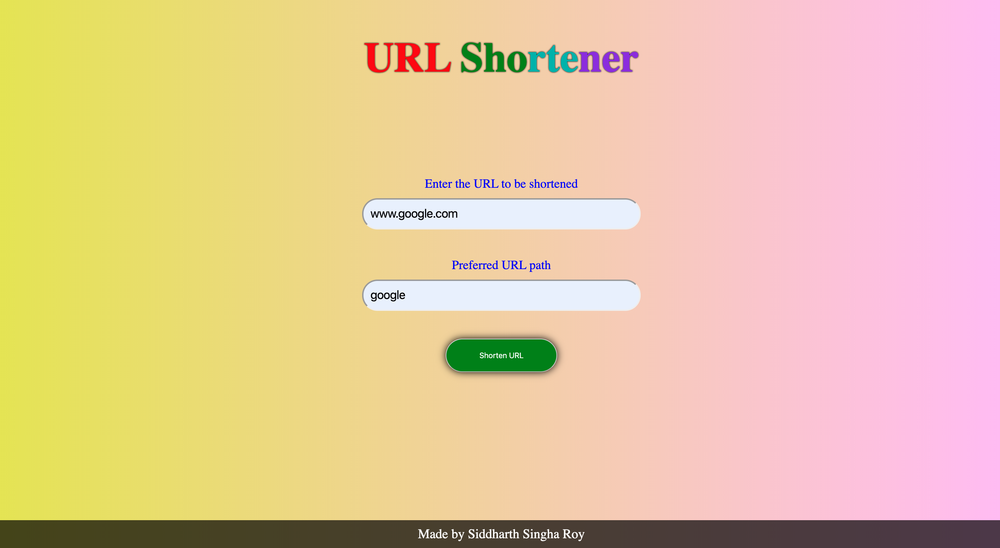

# A URL Shortener made using Django

## Example

## To run this on your local machine

### 1. Fork this repo and then clone it
### 2. Change directory into the cloned folder
`pip3 install -r requirements.txt`
### Then
`cd UrlShortener`
### 3. Now we need to migrate the database
`python3 manage.py makemigrations`

`python3 manage.py migrate`

### To run this 
`python3 manage.py runserver`
